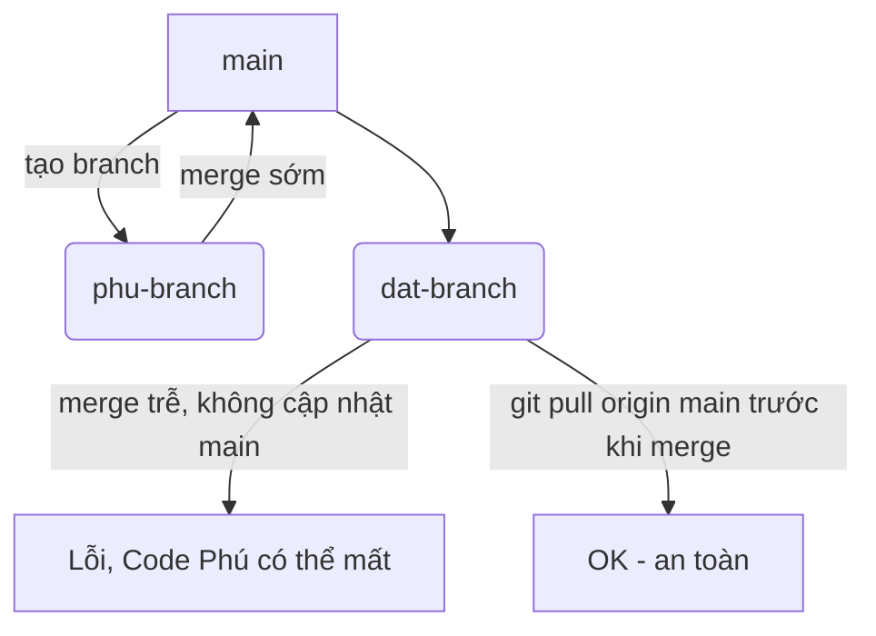

# MovieTicketBox 🎥🍿

MovieTicketBox là một ứng dụng di động giúp người dùng dễ dàng đăng nhập, đăng ký và đặt vé xem phim trực tuyến. Ứng dụng hỗ trợ người dùng quản lý các vé của mình và nhận thông báo về các bộ phim mới nhất.


## Tính năng ✨

- **Đăng nhập**: Người dùng có thể đăng nhập vào ứng dụng với tài khoản của mình.
- **Đăng ký**: Cung cấp tính năng đăng ký mới cho người dùng.
- **Đặt vé**: Cho phép người dùng tìm kiếm và đặt vé cho các bộ phim.
- **Giao diện đẹp mắt**: Giao diện người dùng dễ sử dụng và thân thiện.
- **Thể loại phim phong phú**: Tìm kiếm các bộ phim yêu thích theo thể loại.


## Màn hình chính 🏠


## Hướng dẫn cài đặt 🛠️

### 1. Clone dự án về máy:

```bash
git clone https://github.com/Wizin25/Movieticketbox.git
```
### 2. Cài đặt dependencies:
Trong thư mục dự án, mở Terminal và chạy lệnh sau:

```bash
./gradlew build
```
### 3. Chạy ứng dụng:
Mở Android Studio, chọn Run hoặc sử dụng lệnh sau để chạy ứng dụng trên thiết bị giả lập hoặc thật:

```bash
./gradlew installDebug
```

## Cấu hình bảo mật mạng 🌐
Để cho phép giao tiếp với API qua HTTP (kể cả khi không sử dụng HTTPS), hãy tạo file network_security_config.xml trong thư mục res/xml với nội dung sau:

```xml
<?xml version="1.0" encoding="utf-8"?>
<network-security-config>
    <domain-config cleartextTrafficPermitted="true">
        <domain includeSubdomains="true"><your-api-domain></domain>
    </domain-config>
</network-security-config>
```
Và trong AndroidManifest.xml:

```xml
<application
    android:networkSecurityConfig="@xml/network_security_config"
    ... >
    <!-- Các thẻ khác -->
</application>
```
## Các công nghệ được sử dụng 🛠️
- **Android**: Nền tảng phát triển ứng dụng di động.
- **Retrofit**: Thư viện để giao tiếp với API.
- **Gson**: Chuyển đổi dữ liệu JSON thành đối tượng Java.
- **Room Database**: Lưu trữ dữ liệu nội bộ cho ứng dụng.
## Các lỗi thường gặp và khắc phục ⚠️
 1. Lỗi **"Register failed: Conflict"** (Mã lỗi 409):
- **Nguyên nhân**: `username` hoặc `email` đã tồn tại trong hệ thống.-
- **Khắc phụ**c: Đảm bảo rằng các trường nhập liệu (username, email) là duy nhất trước khi gửi yêu cầu đăng ký.
 2. Lỗi **"Internal Server Error"** (Mã lỗi 500):
- **Nguyên nhân**: Có sự cố từ phía server khi xử lý yêu cầu.
- **Khắc phục**: Kiểm tra log của server hoặc xem lại API của bạn.
## Contributing 🤝
Chúng tôi rất hoan nghênh đóng góp từ cộng đồng! Nếu bạn có ý tưởng hay hoặc phát hiện lỗi, vui lòng tạo Issue hoặc gửi Pull Request.
# 👥 Git Workflow cho teamwork (Bạn Thư đọc cái này nhé)

### 🚨 Vấn đề:
Khi có 2 người cùng pull `main` về để làm việc nhưng merge code không đúng cách:
- Phú merge trước, Đạt merge sau → nếu Đạt không cập nhật lại từ `main` mới → phần code của Phú **có thể bị mất** khi merge Đạt.

### ✅ Cách giải quyết đúng:
1. **Mỗi người làm trên nhánh riêng** (không code trực tiếp trên `main`).
2. Trước khi tạo Pull Request:
```sh
# Đảm bảo đang ở đúng nhánh làm việc
git checkout dat-branch

# Kéo phiên bản mới nhất từ main về nhánh của bạn
git pull origin main
```

3. Nếu có conflict → Git sẽ yêu cầu resolve → resolve xong `commit` lại.
```sh
git add .
git commit -m "resolve conflict"
git push origin dat-branch
```
4. **Sau khi đã cập nhật với main**, mới được tạo Pull Request.
5. Người quản lý sẽ **review & merge** lên main.

### 🛡️ Gợi ý:
- Tránh code trên `main`.
- Luôn **pull main trước khi merge hoặc tạo pull request**.
- Có thể dùng GitHub Actions để kiểm tra tự động conflict hoặc build/test.

---

## 🧭 Sơ đồ Git Flow (Minh họa trực quan)



---

### Mô tả quy trình pull request:
1. Developer tạo branch từ main
2. Code và commit trên nhánh riêng
3. Trước khi PR, pull main về resolve conflict
4. Push code → Tạo Pull Request
5. Reviewer xem & duyệt → Merge lên main

📌 Luôn nhớ: **pull main trước khi merge** nhằm tránh conflict!

---
🎉 Chúc cả nhóm làm việc hiệu quả, teamwork đồng bộ!

## Liên hệ 📞   
- Email: contact@movieticketbox.com
- Website: movieticketbox.com
